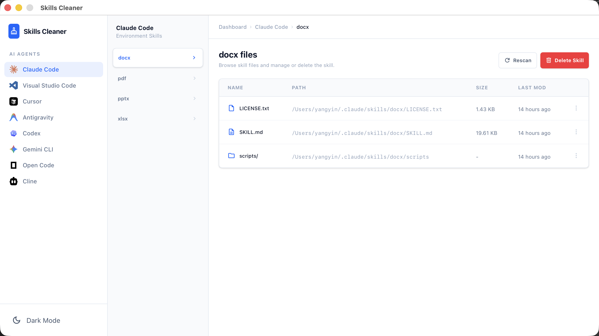

# Skills Cleaner

[English](./README.md) | 简体中文

一个用于清理 AI Agent Skills 的桌面应用程序。



## 功能特点

- 🔍 **多Agent支持**：支持 Claude Code、Visual Studio Code、Cursor、Antigravity 等多个 AI Agent
- 📁 **可视化管理**：直观浏览每个 Agent 下的所有 Skills 及其文件
- 🗑️ **快速删除**：一键删除不需要的 Skills
- 🔄 **实时刷新**：使用 "Rescan" 按钮可刷新当前 Agent 的 Skills 列表

## 技术栈

- **后端**：Go + Wails v2
- **前端**：React + TypeScript + Vite
- **样式**：Tailwind CSS + Motion (Framer Motion)
- **UI组件**：Material Symbols Icons

## 快速开始

### 环境要求

- Go 1.18+
- Node.js 20+
- Wails v2

### 开发模式

1. 克隆项目并进入目录：
```bash
cd skills-cleaner
```

2. 安装前端依赖：
```bash
cd frontend && npm install
```

3. 启动开发服务器：
```bash
cd .. && wails dev
```

应用将以开发模式启动，支持热重载。前端开发服务器地址：http://localhost:34115

### 构建发布版本

```bash
wails build
```

构建完成后，可执行文件位于 `build/bin/` 目录。

## 使用说明

1. 启动应用后，左侧边栏显示支持的 AI Agent 列表
2. 选择一个 Agent，中间栏会显示该 Agent 下所有已安装的 Skills
3. 点击某个 Skill，右侧会显示该 Skill 包含的所有文件及详细信息
4. 如需删除某个 Skill，点击右上角的 "Delete Skill" 按钮
5. 使用 "Rescan" 按钮可刷新当前 Agent 的 Skills 列表

## 支持的 Agent 路径

- **Claude Code**: `~/.claude/skills/`
- **Visual Studio Code**: `~/.copilot/skills/`
- **Cursor**: `~/.cursor/skills/`
- **Antigravity**: `~/.antigravity/skills/`
...

## 项目结构

```
skills-cleaner/
├── app.go              # Go 后端逻辑
├── main.go             # 应用入口
├── frontend/           # React 前端
│   ├── src/
│   │   ├── App.tsx     # 主应用组件
│   │   └── ...
│   └── ...
└── build/              # 构建输出目录
```

## 开发

### 修改配置

编辑 `wails.json` 可以配置项目设置。

### 前端开发

前端使用 Vite 作为构建工具，支持热模块替换（HMR）。在开发模式下修改前端代码会自动刷新。

### 后端开发

修改 Go 代码后，需要重启 `wails dev` 以应用更改。

## License

MIT
